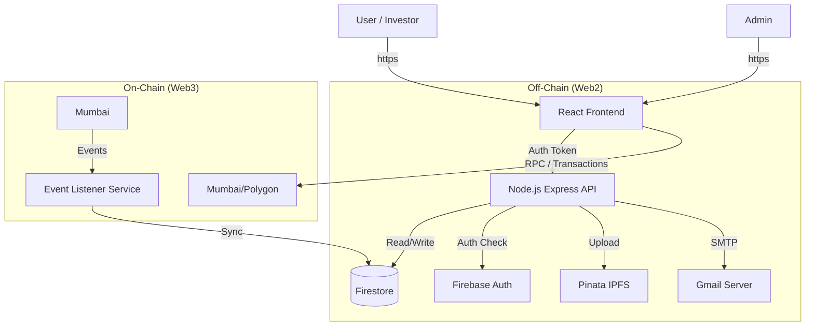

# 02 Tech Stack and Architecture

## Technology Stack

### Frontend
*   **Framework**: React.js (Vite)
*   **Styling**: Tailwind CSS
*   **Web3 Integration**: Ethers.js v5
*   **State Management**: React Context / Hooks

### Backend
*   **Runtime**: Node.js
*   **Framework**: Express.js
*   **Middleware**: Custom RBAC (Role-Based Access Control)
*   **Services**:
    *   Blockchain Event Listener (ethers.js websocket/polling)
    *   Email Service (Nodemailer + Gmail SMTP)

### Database & Storage
*   **Primary DB**: Google Firestore (NoSQL)
    *   Stores: Users, Properties (metadata mirror), Transaction Logs, Notifications.
*   **File Storage**: IPFS via **Pinata**
    *   Stores: Property deeds, Images, Metadata JSONs.
*   **Auth**: Firebase Authentication (Email/Password + Wallet linking logic).

### Blockchain
*   **Network**: Polygon Mumbai Testnet
*   **Languages**: Solidity (v0.8.x)
*   **Framework**: Hardhat
*   **Standards**:
    *   ERC-721 (Property NFT)
    *   ERC-20 (Fractional Shares)
    *   OpenZeppelin Contracts

## Architecture Diagram (Text Representation)

## Integration Points

1.  **Frontend <-> Blockchain**:
    *   Direct read/write capabilities via MetaMask + Ethers.js for purchasing and share transfers.
2.  **Frontend <-> Backend**:
    *   REST API for user profiles, browsing properties (faster than RPC), and admin actions (uploading docs).
3.  **Backend <-> Blockchain**:
    *   **Listener**: The backend listens for contract events (`SharePurchased`, `PropertyCreated`) to update Firestore state.
    *   **Oracle (Mock)**: Endpoint to fetch INR -> MATIC conversion rates.

## Failure Handling
*   **Blockchain**: Frontend handles rejected transactions or RPC errors with toast notifications.
*   **IPFS**: Pinata fallback logic or retry mechanism on upload failure.
*   **Sync**: If the Event Listener goes down, a `sync-script` can be manually triggered to reconcile Firestore with the Blockchain state.
